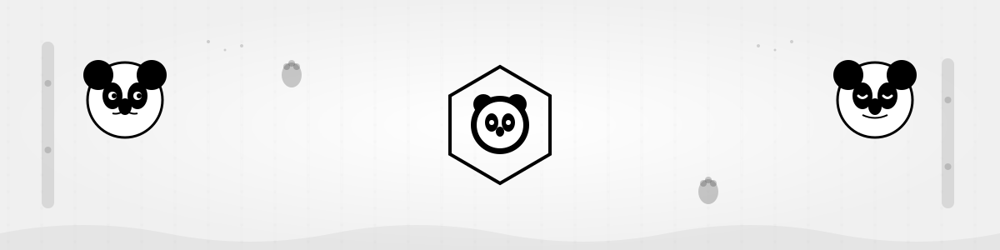

<div align="center">



<br/><br/>

<a href="https://www.linkedin.com/in/aryan-adhikari-3051721aa/"></a>
<a href="https://aryan-adhikari.vercel.app/"></a>
<a href="mailto:aadhikari678@outlook.com"></a>


<br/><br/>


</div>

<br/>


<br/>

<table>
<tr>
<td width="50%" valign="top">

<div align="center">

</div>

</td>
<td width="50%" valign="top">

<div align="center">

</div>

</td>
</tr>
</table>


<br/>

<div align="center">

## 🥋


</div>

<br/>


<br/>

<div align="center">

## 🎯

</div>

| 🤖 | 📦 |
|---|---|
| **[YAAKE](https://github.com/Aryan01101/YAAKE)** | AI recruitment platform with Google Gemini integration. Resume parsing, ATS scoring, mock interviews, cover letter generation. JWT auth, RBAC architecture. |
| **ML Healthcare Analytics @ Jacaranda Flame** | Led 5-engineer team processing 100k+ healthcare records. K-means clustering optimization (23% faster convergence). Automated data pipelines. |

| 💰 | 🔧 |
|---|---|
| **[Over-save](https://github.com/Aryan01101/OVER-SAVE)** | Gamified budget tracker. Expense tracking, savings goals, financial insights. Java + Spring Boot, OAuth2, 15+ database tables, 16 API endpoints. |
| **Automation Pipelines** | Reduced manual processing by 95% through intelligent workflow automation and data transformation systems. |

<br/>


<br/>

<div align="center">

## 📊


<br/><br/>


</div>

<br/>


<br/>

<div align="center">

## 🎓

**Bachelor of Software Engineering (Honours)**
*The University of Sydney*

**Thesis:** Quantifying Urban Cooling Effectiveness: A Satellite Analysis of Sydney

<br/>

**🏢**

Software Engineer @ Jacaranda Flame · Engineering Consulting @ Ampol
Spatial AI Entrepreneur Intern @ EON Reality · Software Engineer @ AdGrowth Solutions

<br/>

**🌟**

Marketing Director @ Sydney Computing Society (SYNCS)
Student Ambassador NSW @ Engineers Australia
PEP Program Mentor @ USYD

<br/>

*NSW Volunteer of the Year 2024*

</div>

<br/>


<br/>

<div align="center">

## 🏃‍♂️

**🧗 Bouldering** · Currently projecting V6s at local Sydney gyms
**🏀 Basketball** · Pickup games most evenings
*Problem solving mindset translates across domains*

</div>

<br/>


<br/>

<div align="center">

<sub>SEEKING SOFTWARE ENGINEERING ROLES IN AUSTRALIA</sub>
<sub>OPEN TO: FULL STACK · AI/ML · BACKEND SYSTEMS · STARTUP ENVIRONMENTS</sub>

<br/><br/>


</div>

<br/>


<br/>

<div align="center">

## 🐍

<picture>
  <source media="(prefers-color-scheme: dark)" srcset="https://raw.githubusercontent.com/Aryan01101/Aryan01101/output/panda-contribution-snake.svg">
  <source media="(prefers-color-scheme: light)" srcset="https://raw.githubusercontent.com/Aryan01101/Aryan01101/output/panda-contribution-snake.svg">
  
</picture>

</div>

<br/>


<br/>

<div align="center">

```
  🐼
 /||\    Shipping code, solving problems
  ||     One bamboo stick at a time
 /  \
```

</div>
